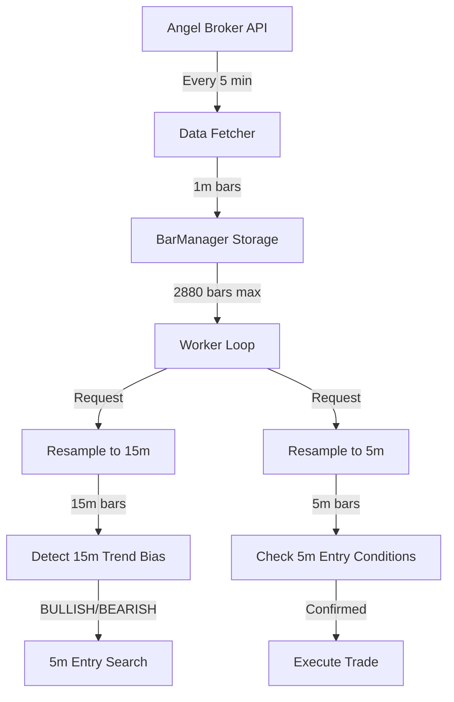

# Data Flow: How 1m Bars Become Trading Signals

## Overview

Your bot uses a **multi-timeframe strategy** where 1-minute bars are resampled into higher timeframes for signal detection.

## The Complete Flow



## Detailed Timeline Example

### Time: 09:15:00 - Bot Starts

```
[NIFTY] Loading historical data...
[NIFTY] Loaded 2880 historical 1m bars (last 2 days)
[NIFTY] 📡 Data fetcher task started
[NIFTY] 🚀 Worker task started
```

**BarManager now has**: 2,880 × 1-minute bars

---

### Time: 09:15:30 - First Worker Loop

```
[NIFTY] 🔄 Loop #1 at 09:15:30 (bars: 2880)
[NIFTY] 📈 Fetching resampled bars (5m, 15m)...
```

**What happens internally:**
1. Takes the 2,880 × 1m bars
2. Resamples to **576 × 5m bars** (2880 ÷ 5)
3. Resamples to **192 × 15m bars** (2880 ÷ 15)

```
[NIFTY] 📊 Data available: 5m bars=576, 15m bars=192
[NIFTY] 🔍 Detecting 15m trend bias...
```

**15m Bias Detection:**
- Looks at the **latest 15m bars** (e.g., last 50 bars)
- Checks if EMA/MACD/SuperTrend shows BULLISH or BEARISH trend
- This is your **primary trend filter**

```
[NIFTY] ⛔ No 15m bias detected, sleeping 60s...
```

---

### Time: 09:20:00 - Data Fetcher Runs

```
[NIFTY] 📡 Data fetch #1 at 09:20:00 - Fetching latest 1m bars...
[NIFTY] ✅ Data fetch #1: Added 5 new bars (total: 2885)
[NIFTY] 💤 Data fetcher sleeping 5 minutes...
```

**What happened:**
- Fetched the last 15 minutes of 1m bars from Angel API
- Added 5 new 1m bars (09:15 to 09:20)
- BarManager now has 2,885 bars (old ones get dropped due to max limit)

---

### Time: 09:25:30 - Worker Detects 15m Bias

```
[NIFTY] 🔄 Loop #11 at 09:25:30 (bars: 2890)
[NIFTY] 📈 Fetching resampled bars (5m, 15m)...
[NIFTY] 📊 Data available: 5m bars=578, 15m bars=192
[NIFTY] 🔍 Detecting 15m trend bias...
[NIFTY] ✅ 15m bias detected: BULLISH
[NIFTY] 🎯 NEW 15m signal: BULLISH - Starting 5m entry search...
```

**What happened:**
- The latest 1m bars formed a new 15m candle
- The 15m trend now shows BULLISH bias
- Bot starts looking for 5m entry confirmation

---

### Time: 09:26:30 - 5m Entry Check #1

```
[NIFTY] 🔎 Starting 5m entry confirmation loop (max 10 checks)...
[NIFTY] 🔍 5m check #1/10 - waiting 60s for next bar...
```

**Wait 60 seconds for new 1m bar to form...**

```
[NIFTY] 🔄 5m check #1: 15m bias revalidation: BULLISH (was: BULLISH)
[NIFTY] 🎯 5m check #1: Checking entry conditions...
[NIFTY] ⛔ 5m check #1: No entry signal yet
```

**What happened:**
- Resampled 1m bars to 5m bars
- Checked if 5m shows entry signal (e.g., RSI oversold bounce, price above EMA)
- Not yet, so continue checking...

---

### Time: 09:28:30 - 5m Entry Check #3 - CONFIRMED!

```
[NIFTY] 🔍 5m check #3/10 - waiting 60s for next bar...
[NIFTY] 🔄 5m check #3: 15m bias revalidation: BULLISH (was: BULLISH)
[NIFTY] 🎯 5m check #3: Checking entry conditions...
[NIFTY] ✅ 5m ENTRY SIGNAL CONFIRMED: BULLISH - RSI oversold bounce
```

**What happened:**
- New 1m bars formed a new 5m candle
- The 5m candle shows entry conditions are met
- 15m bias is still BULLISH (confirmed)
- **TRADE ENTRY TRIGGERED!**

---

## Key Points

### 1. **Data Collection**
- **Every 5 minutes**: New 1m bars are fetched
- **Every 60 seconds**: Worker loop checks for signals
- 1m bars are the **foundation** - everything else is derived from them

### 2. **Resampling is Dynamic**
- 5m and 15m bars are **not stored separately**
- They are **calculated on-demand** from 1m bars
- This ensures you always have the latest data

### 3. **Why This Works**

| Timeframe | Purpose | How Many 1m Bars Needed |
|-----------|---------|-------------------------|
| **15m** | Trend direction (bias) | 15 bars = 1 candle |
| **5m** | Entry timing | 5 bars = 1 candle |
| **1m** | Raw data collection | 1 bar = real-time |

**Example:**
- To form **one 15m candle**, you need **15 × 1m bars**
- To have **50 × 15m candles** for trend analysis, you need **750 × 1m bars**
- Your bot keeps **2,880 × 1m bars** (2 days), which gives you plenty of historical context

### 4. **The Strategy**

```
Step 1: Check 15m timeframe
  ↓
  Is there a clear BULLISH or BEARISH trend?
  ↓
  NO → Wait 60s, check again
  ↓
  YES → Proceed to Step 2

Step 2: Check 5m timeframe (up to 10 times)
  ↓
  Does 5m show entry signal in the same direction?
  ↓
  NO → Wait 60s, check again (max 10 checks)
  ↓
  YES → Execute trade!
```

## Why Fetch Every 5 Minutes?

You might ask: "Why not fetch every 1 minute?"

**Answer:**
- **API rate limits**: Angel Broker limits API calls
- **Efficiency**: You don't need every single 1m bar immediately
- **Buffering**: Fetching 15 minutes of data ensures you don't miss bars if there's a brief network issue
- **5 minutes is enough**: Your worker loop checks every 60s, so having data updated every 5 min is sufficient

## Summary

✅ **1m bars** are fetched every 5 minutes (raw data)  
✅ **15m bars** are resampled from 1m bars to detect trend bias  
✅ **5m bars** are resampled from 1m bars to find entry timing  
✅ **Worker loop** checks every 60 seconds for signals  
✅ **Trade execution** happens when both 15m bias and 5m entry align  

This multi-timeframe approach gives you:
- **15m**: The "big picture" trend direction
- **5m**: The precise entry timing
- **1m**: The raw data that makes it all possible
