# ORB (Opening Range Breakout) Strategy Flow

Visual representation of the ORB strategy implementation.

## Strategy Flow

```mermaid
flowchart TD
    subgraph INIT["🚀 Initialization"]
        A[Bot Starts] --> B{Check Strategy}
        B -->|STRATEGY=ORB| C[Load ORB Worker]
        B -->|STRATEGY=MACD_EMA| Z[Load Default Worker]
    end

    subgraph ORB_BUILD["📊 ORB Building Phase (30 min)"]
        C --> D{Market Open?}
        D -->|No| D1[Wait for Market]
        D1 --> D
        D -->|Yes| E[Build ORB Range]
        E --> F["Collect 9:15-9:45 IST (Angel)<br>or 9:30-10:00 ET (IBKR)"]
        F --> G[Calculate ORB High/Low]
    end

    subgraph BREAKOUT["🔷 Breakout Detection (30m Candles)"]
        G --> H{ORB Complete?}
        H -->|No| F
        H -->|Yes| I[Wait for 30m Candle Close]
        I --> J{Check Breakout}
        J --> K{Close > ORB High<br>AND Low > ORB High?}
        J --> L{Close < ORB Low<br>AND High < ORB Low?}
        K -->|Yes| M[LONG Breakout ✅]
        L -->|Yes| N[SHORT Breakout ✅]
        K -->|No| O{Time < Max Entry Hour?}
        L -->|No| O
    end

    subgraph ENTRY["📥 Entry Execution"]
        M --> P[Calculate ATR Risk]
        N --> P
        P --> Q["Risk = max(ATR × 1.2, ORB_Range × 0.5)"]
        Q --> R[Calculate SL/TP<br>RR Ratio 1:1.5]
        R --> S{Select Option}
        S -->|AngelOne| T[CE for LONG<br>PE for SHORT<br>Current Expiry]
        S -->|IBKR| U[Call for LONG<br>Put for SHORT<br>0 DTE]
        T --> V[Place Bracket Order]
        U --> V
        V --> W[Track Position]
    end

    subgraph EXIT["⚠️ Exit Management"]
        W --> X{Check Exit Conditions}
        O -->|Yes| I
        O -->|No| Y[Stop Monitoring]
        X --> X1{SL/TP Hit?}
        X --> X2{15 min before close?}
        X --> X3{Trade already taken?}
        X1 -->|Yes| AA[Position Closed]
        X2 -->|Yes| BB[Force Exit EOD]
        X3 -->|Yes| CC[Monitor Only]
        BB --> AA
    end

    subgraph CLEANUP["👋 End of Day"]
        AA --> DD{More Symbols?}
        CC --> DD
        DD -->|Yes| I
        DD -->|No| EE[Send Daily Summary]
        EE --> FF[Reset State]
        FF --> D
    end
```



## Key Differences by Broker

| Feature | AngelOne | IBKR |
|---------|----------|------|
| **Symbols** | NIFTY, BANKNIFTY | SPX, NDX |
| **Market Hours** | 9:15 AM - 3:30 PM IST | 9:30 AM - 4:00 PM ET |
| **ORB Period** | 9:15 - 9:45 IST (30 min) | 9:30 - 10:00 ET (30 min) |
| **Option Expiry** | Current week expiry | 0 DTE (same day) |
| **Force Exit** | 3:15 PM IST | 3:45 PM ET |
| **Breakout TF** | 30-minute candles | 30-minute candles |

## Configuration

Set these environment variables to enable ORB strategy:

```bash
# Strategy selection
STRATEGY=ORB  # or MACD_EMA (default)

# ORB parameters (optional, shown with defaults)
ORB_BREAKOUT_TIMEFRAME=30  # 30-min candles for confirmation
ORB_ATR_LENGTH=14
ORB_ATR_MULTIPLIER=1.2
ORB_RISK_REWARD=1.5
ORB_MAX_ENTRY_HOUR=14
```
